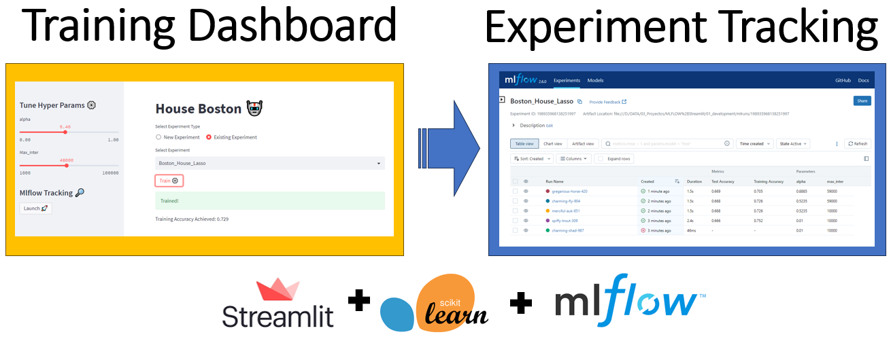
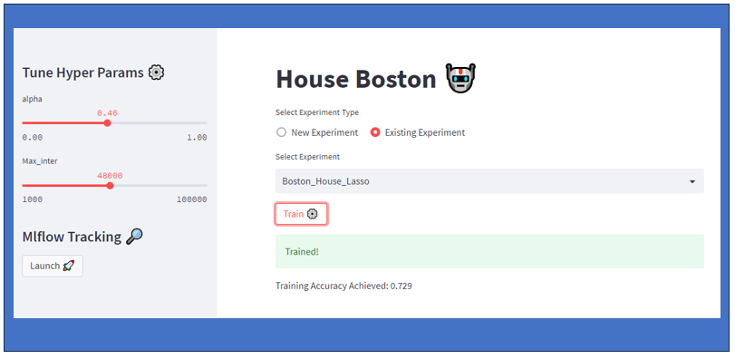
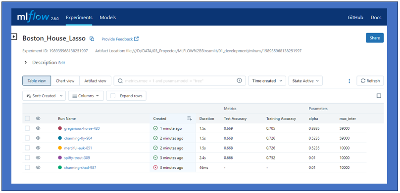

# MLOPS: Streamlit + MLFLOW Training Dashboard

# 1. Project Overview
Small test to see how MLFLOW relates to experiment tracking with other frameworks, in this case I have chosen Streamlit.

The dashboard allows us to change the alpha values and the maximum number of iterations in this lasso regression model.

The model is the classic regression model that predicts the price of houses in Boston.
# 2. Testing
## 2.1 Prerequisites

- Create a env, if use conda:

        pip install -r requirements.txt

## 2.2 run the script
- From the console we go to the folder `development`
- Run the command

        streamlit run mlflow_streamlit.py

- Dashboard url

        http://192.168.1.134:8501 

- MLFlow url

        http://localhost:5000/
## 2.3 dashboard

- **New Experiment:**
        - Enter the name of the experiment in the text box.
        
- **Existing Experiment:**
        - With the drop-down menu we can choose the experiment
- **Train Button:**
        - Enter the name of the experiment in the text box or select the experiment.
        - Pressing the train button launches the training. 
        - We set the alpha and max interaction values by using the slides
        - On completion it returns the value of acuracy
- **Launch Button:**
        - This button takes us to the mlflow dashboard.

